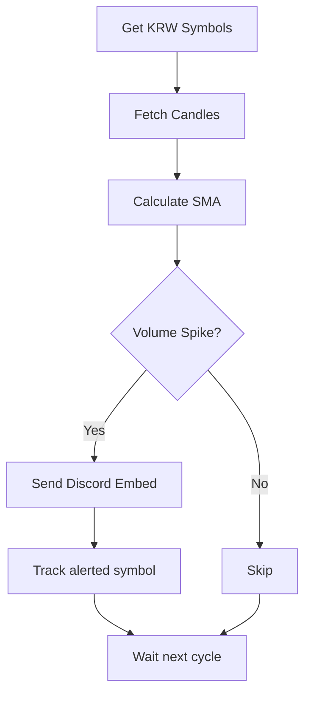

# Bithumb Volume Alert

빗썸 KRW 마켓을 순회하면서 캔들 거래량이 평균 대비 급증한 종목을 Discord로 알리는 Python 모니터입니다.

---

## 핵심 흐름



---

## 현재 구현 기능

- KRW 마켓 전체 종목 조회 (`ticker/ALL_KRW`)
- 종목별 캔들 조회 후 거래량 스파이크 계산
- 기본 룰: `current_volume >= SMA(sma_period) * volume_multiplier`
- Discord Embed 알림(거래량/배수/현재가/시간)
- 중복 알림 방지(메모리 Set)
- 옵션으로 알림 캐시 주기적 리셋(`ALERT_RESET_HOURS`)

---

## 빠른 시작

### 1) 설치

```bash
python3 -m venv .venv
source .venv/bin/activate
pip install -r requirements.txt
```

### 2) 환경 변수

```bash
cp env.example .env
```

`DISCORD_WEBHOOK_URL`을 실제 값으로 바꿔주세요.

### 3) 실행

```bash
python main.py
```

백그라운드 실행 예시:

```bash
nohup python main.py > monitor.log 2>&1 &
```

---

## 설정값

| 변수 | 기본값(코드 기준) | 설명 |
|---|---:|---|
| `DISCORD_WEBHOOK_URL` | (필수) | Discord Webhook URL |
| `CHECK_INTERVAL` | `300` | 모니터링 주기(초) |
| `VOLUME_MULTIPLIER` | `5.0` | 스파이크 배수 임계값 |
| `SMA_PERIOD` | `20` | 거래량 SMA 기간 |
| `CANDLE_INTERVAL` | `5m` | 캔들 간격 (`1m,3m,5m,15m,30m,1h,4h,1d`) |
| `RUN_ONCE` | `false` | `true`면 1회만 실행 |
| `LOG_FILE` | `bithumb_monitor.log` | 로그 파일 경로 |
| `API_TIMEOUT` | `10` | 빗썸 API 타임아웃(초) |
| `WEBHOOK_TIMEOUT` | `10` | Discord 요청 타임아웃(초) |
| `API_DELAY` | `0.1` | 종목 간 API 호출 지연(초) |
| `ALERT_RESET_HOURS` | `None` | 중복알림 캐시 리셋 주기(시간) |

> `env.example`에는 `CHECK_INTERVAL=60`, `ALERT_RESET_HOURS=24` 예시가 들어있습니다.

---

## 동작 메모

- 연속 모드에서 시작 시 테스트 메시지 1회를 보냅니다.
- 프로세스 재시작 시 중복알림 캐시는 초기화됩니다(메모리 기반).
- 네트워크/요청 오류 발생 시 로그를 남기고 다음 사이클에서 재시도합니다.

---

## 파일 구조

```bash
├── main.py
├── bithumb_api.py
├── discord_webhook.py
├── env.example
├── requirements.txt
└── README.md
```
